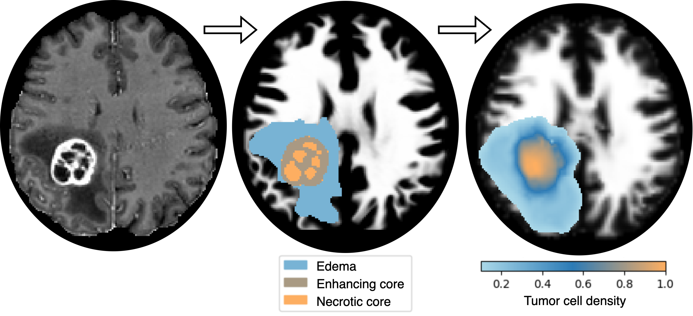

# PhysRegTumor
**Physics-Regularized Multi-Modal Image Assimilation for Brain Tumor Localization**  
(NeurIPS 2024)  

If you have any suggestions or encounter difficulties, feel free to reach out via email at:  
[email_michal](mailto:michal.balcerak@uzh.ch)


---
## Synthetic Data

If you want an easy jupyternotebook with synthetic data playground go to: https://github.com/m1balcerak/TumorGrowthToolkit


## Required Packages

To run this project, make sure you have the necessary dependencies installed. You can use the provided `requirements_PhysRegTumor.txt` file to install all required packages.

To install the dependencies, run the following command (with python 3.11.2):

```bash
pip install -r requirements_PhysRegTumor.txt
```

---

## Running the Code

To run the project, follow these steps:

1. Ensure that your environment is set up with the required dependencies (as outlined above).
2. Open your terminal and navigate to the project directory. Make sure you have execute permission for the script. If needed, update the permissions with the following command:

   ```bash
   chmod +x run_instance.sh
   ```

3. Inspect the `run_instance.sh` script to make sure that you’ve selected the correct paths to your dataset and the desired patient code(s) for calculation. The relevant lines in the script will look like this:

   ```bash
   WM_FILE_PATH="/path_to_data/data_${code}/t1_wm.nii.gz"
   GM_FILE_PATH="/path_to_data/data_${code}/t1_gm.nii.gz"
   CSF_FILE_PATH="/path_to_data/data_${code}/t1_csf.nii.gz"
   SEGM_FILE_PATH="/path_to_data/data_${code}/segm.nii.gz"
   PET_FILE_PATH="/path_to_data/data_${code}/FET.nii.gz"
   ```

   - Replace `/path_to_data` with the actual path where your dataset is stored.
   - Set `${code}` to the code of the patient you want to process.

4. The output of the script will be saved in a directory named `FK_${code}`, containing all results for the selected patient.

5. If you don't have PET imaging available, you can still run the framework, but make sure to set the PET weight to zero in the `PhysRegTumor.py` script by adjusting the following line:

   ```python
   pet_w = 0
   ```

6. Once you've made the necessary adjustments, run the bash script with the following command:

   ```bash
   bash run_instance.sh
   ```

---

## Output

The output of the framework is a nifty file named 'c_euler_last_timestep.nii' with the tumor cell 3D concentraion map.

The results are stored in the same resolution as the input data, ensuring compatibility for further analysis. Takes around 4h on RTX 6000 per patient. 38 GB of memory required. 


## Data

The dataset used in this project can be found at the following link. We included only those patients (n=58) who had existing FET.nii.gz files, corresponding to the FET-PET modality.

[GliODIL Dataset](https://huggingface.co/datasets/m1balcerak/GliODIL)

---
## Citation

If you find this work useful, please consider citing it:

```bibtex
@article{balcerak2024physics,
  title={Physics-Regularized Multi-Modal Image Assimilation for Brain Tumor Localization},
  author={Balcerak, Michal and Amiranashvili, Tamaz and Wagner, Andreas and Weidner, Jonas and Karnakov, Petr and Paetzold, Johannes C and Ezhov, Ivan and Koumoutsakos, Petros and Wiestler, Benedikt and Menze, Bjoern},
  journal={arXiv preprint arXiv:2409.20409},
  year={2024}
}
```

If you use the dataset, please also cite its source:

```bibtex
@article{balcerak2023individualizing,
  title={Individualizing glioma radiotherapy planning by optimization of a data and physics informed discrete loss},
  author={Balcerak, Michal and Ezhov, Ivan and Karnakov, Petr and Litvinov, Sergey and Koumoutsakos, Petros and Weidner, Jonas and Zhang, Ray Zirui and Lowengrub, John S and Wiestler, Bene and Menze, Bjoern},
  journal={arXiv preprint arXiv:2312.05063},
  year={2023}
}
```

